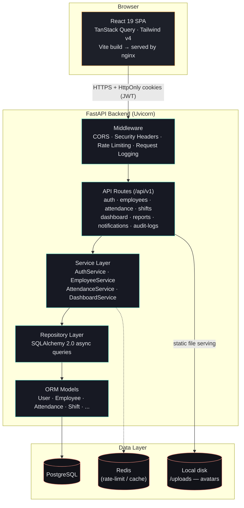
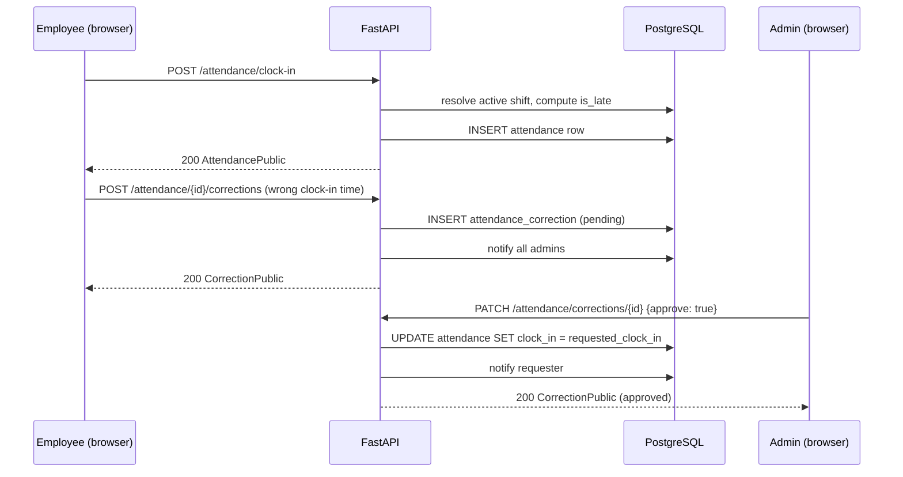

# Meridian — Attendance Management System (AMS)

A production-oriented attendance management system built from scratch: shift-aware clock
in/out, break tracking, correction workflows, role-based access control, admin analytics
(including a gamified attendance leaderboard), and a fully themed React frontend.

**Stack:** FastAPI + SQLAlchemy 2.0 (async) + PostgreSQL on the backend, React 19 + TypeScript
+ Tailwind CSS v4 on the frontend, JWT auth with refresh-token rotation, Docker Compose for
one-command local deployment.

---

## Table of Contents

- [Features](#features)
- [Architecture](#architecture)
- [Tech Stack](#tech-stack)
- [Project Structure](#project-structure)
- [Getting Started](#getting-started)
- [API Overview](#api-overview)
- [Testing](#testing)
- [Deployment](#deployment)
- [Security](#security)

---

## Features

### Authentication & Access Control
- JWT authentication with **refresh-token rotation** and reuse detection (a replayed, revoked
  token invalidates the entire session chain)
- Argon2 password hashing, account lockout after repeated failed logins, password reset flow
- Role-based access control — **Super Admin / Admin / Employee** — enforced **per record**, not
  just per route (an employee can never fetch another employee's data, even by guessing an ID)
- Full audit log of logins, logouts, and every data-changing action (old/new values, IP,
  user agent)

### Organization & People
- Branches, departments, employees, manager hierarchies
- Employee self-service: edit name/phone, upload a profile picture (validated file type/size,
  no path-traversal surface)
- Admin employee directory: create, edit (department/manager/job title/join date/employment
  status), deactivate

### Attendance
- Shift-aware clock in/out — day/night/24-hour/flexible/split shifts, cross-midnight handling,
  configurable grace period
- **Manual time entry** for clock-in/out (validated: same-day only, never in the future)
- Break tracking (8 break types, paid/unpaid, max-break-minutes enforcement)
- Late arrival / early leave / missing punch detection, automatic overtime calculation
- **Correction request → admin approval workflow** that actually mutates the attendance record
  on approval, with in-app notifications to the requester and every admin
- Keyboard shortcuts for power users: `Ctrl+Shift+I` clock in, `Ctrl+Shift+O` clock out,
  `Ctrl+Shift+B` start a break

### Dashboards & Reporting
- **Admin dashboard**: headcount, present/absent/late/on-leave/working-now/on-break counts,
  attendance rate, on-time rate, pending corrections, 14-day attendance trend, break-type
  breakdown, employees-by-department chart
- **🏆 Attendance Leaderboard**: top employees by days present, current streak, and earned
  badges (Never Late / Perfect Week / Early Bird) — visible to every role
- **Employee dashboard**: today's status, hours worked, monthly present days, personal
  14-day trend and break breakdown, upcoming holidays
- Attendance summary reports with **CSV export** and **print/PDF export** (browser-native,
  auto-hides navigation chrome and flips to a print-safe color scheme)
- Live in-app notifications (polling, unread badge, mark read/mark all read)

### Shift Management
- Define shifts (name, type, start/end time, grace period, max break, expected hours)
- Assign employees to shifts with effective date ranges

---

## Architecture



**Request flow example — clock-in with a correction later:**



### Clean architecture layers (backend)

```
app/
├── api/v1/        # Route handlers — thin, no business logic
├── auth/          # Current-user extraction from JWT cookie/header
├── permissions/    # RBAC dependency factories (require_admin, require_any_role, ...)
├── core/           # Config, security (JWT/Argon2), logging, exceptions, uploads, rate limiting
├── models/         # SQLAlchemy ORM models
├── schemas/        # Pydantic request/response contracts
├── repositories/   # Data access — raw SQLAlchemy queries, no business rules
├── services/       # Business logic — the only layer that spans multiple repositories
├── middleware/      # Security headers, request logging
└── tests/          # Integration tests against a real Postgres database
```

The frontend mirrors this shape: `api/` (typed HTTP clients), `auth/` (context providers),
`components/ui/` (design-system primitives), `pages/` (feature screens), `hooks/`, `types/`.

---

## Tech Stack

| Layer | Technology |
|---|---|
| Backend framework | FastAPI (Python 3.11+), Uvicorn |
| ORM / DB | SQLAlchemy 2.0 (async), PostgreSQL, Alembic migrations |
| Auth | JWT (access + refresh), Argon2 password hashing, HttpOnly cookies, CSRF cookie |
| Backend tooling | Pydantic v2, structlog, slowapi (rate limiting), pytest, ruff |
| Frontend framework | React 19, TypeScript, Vite |
| Frontend styling | Tailwind CSS v4 (custom "Ink & Amber" design system, light/dark mode) |
| Frontend data | TanStack Query, axios, recharts |
| Frontend testing | Vitest, Testing Library |
| Deployment | Docker, Docker Compose, nginx (frontend), GitHub Actions CI |

---

## Project Structure

```
AMS/
├── backend/                 FastAPI application (see Architecture above)
│   ├── app/
│   ├── migrations/          Alembic migrations
│   └── requirements.txt
├── frontend/                 React + TypeScript SPA
│   └── src/
├── docker-compose.yml        Postgres + Redis + backend + frontend, one command
└── .github/workflows/ci.yml  Lint + test + build on every push/PR
```

---

## Getting Started

### Backend

```bash
cd backend
python -m venv .venv
.venv\Scripts\activate       # Windows; use `source .venv/bin/activate` on macOS/Linux
pip install -r requirements.txt
cp .env.example .env         # edit DATABASE_URL to match your local Postgres
alembic upgrade head
python -m app.db.seed        # seeds the super_admin/admin/employee roles
uvicorn app.main:app --reload
```

Run tests and lint:

```bash
pytest app/tests -q
ruff check app
```

> Tests run against a real Postgres database (`ams_test_db` by default) — schema is
> recreated per-test. Override the connection with the `DATABASE_URL` env var if needed (this
> is how CI points at its ephemeral Postgres service instead of a local instance).

### Frontend

```bash
cd frontend
npm install
cp .env.example .env   # VITE_API_URL defaults to http://localhost:8000/api/v1
npm run dev
```

Run tests, lint, and type-check:

```bash
npm run test
npm run lint
npx tsc --noEmit
```

### Full stack via Docker

```bash
docker compose up --build
```

This runs Postgres, Redis, the backend (migrations + role seeding run automatically on
container start via `docker-entrypoint.sh`), and the frontend (built and served via nginx).

- Backend: http://localhost:8000/docs
- Frontend: http://localhost:5173

The compose backend service overrides `DATABASE_URL`/`REDIS_URL` to point at the `db`/`redis`
service names on the compose network, regardless of what's in your local `.env` (which is
meant for host-based development against your own Postgres instance).

---

## API Overview

All routes are versioned under `/api/v1`. Interactive docs (Swagger/OpenAPI) are available at
`/docs` in non-production environments.

| Group | Examples |
|---|---|
| `auth` | register, login, refresh, logout, change-password, password-reset, sessions |
| `employees` | CRUD, self-service profile (`/employees/me`), avatar upload |
| `departments` / `branches` | organization structure (admin-managed) |
| `shifts` | shift definitions, employee-shift assignments |
| `attendance` | clock-in/out, breaks, corrections, admin manual entry |
| `dashboard` | admin & employee analytics, trend, break analysis, leaderboard |
| `reports` | attendance summary, CSV export |
| `notifications` | list, mark read/mark all read |
| `audit-logs` | admin-only read access to the full audit trail |

## Testing

- **Backend**: 71 integration tests (pytest + httpx) running against a real Postgres schema
  per test — not mocked, so RBAC, cascading correction approvals, and async-relationship
  eager-loading bugs get caught for real.
- **Frontend**: Vitest + Testing Library covering utility functions and core UI components.
- **CI**: `.github/workflows/ci.yml` runs both suites plus lint/type-check/build on every push
  and PR to `main`.

## Deployment

See the [Docker section](#full-stack-via-docker) above. Before deploying to production:

- Set a strong random `JWT_SECRET_KEY` (never use the default)
- Set `COOKIE_SECURE=true` and serve over HTTPS
- Set `ENVIRONMENT=production` (disables `/docs` and `/redoc`)
- Restrict `CORS_ORIGINS` to your actual frontend origin(s)
- Point `VITE_API_URL` at your real API origin when building the frontend image
- Review `MAX_FAILED_LOGIN_ATTEMPTS` / `ACCOUNT_LOCKOUT_MINUTES` for your security posture

## Security

- Argon2 password hashing, JWT access/refresh tokens in HttpOnly cookies, CSRF cookie
- Refresh-token rotation with reuse detection (theft protection)
- RBAC enforced at the record level, not just the route level
- Rate limiting on login/register/password-reset
- Parameterized queries via SQLAlchemy ORM (no raw SQL string interpolation)
- Upload validation: content-type allowlist, size caps, server-generated filenames (no
  path traversal via user-supplied names)
- Full audit trail of security-relevant and data-changing actions
